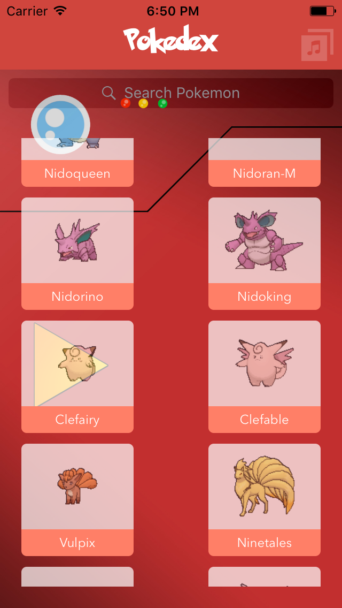
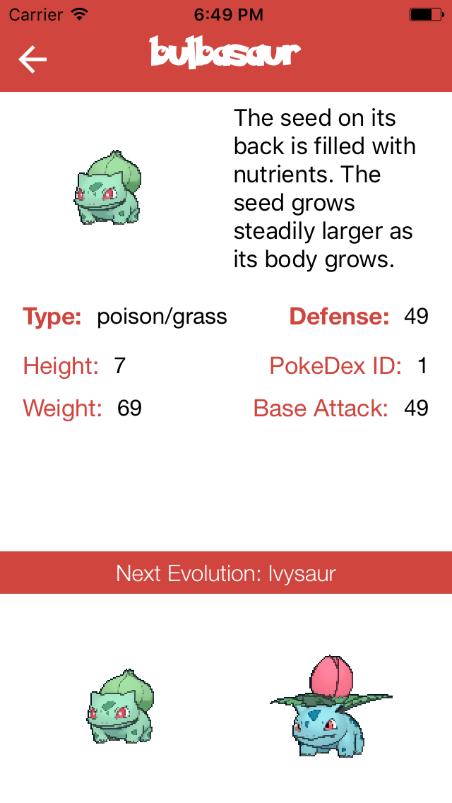

# Pokedex-Swift 3

A very simple example using Swift 3 and consuming pokeapi.co to produce a very small Pokedex. This application was constructed by using the concepts in iOs Development in Devslopes course with some adaptations.

Thank you Nintendo by produce a good game (Pokemon) since 1996, pokecoapi and devslopes course.

## Requirements

This project is structured by using some basic libraries and tools:
	- Cocoapods
	- Alamofire
	- SwiftyJSON

Showcase
---

  
  

